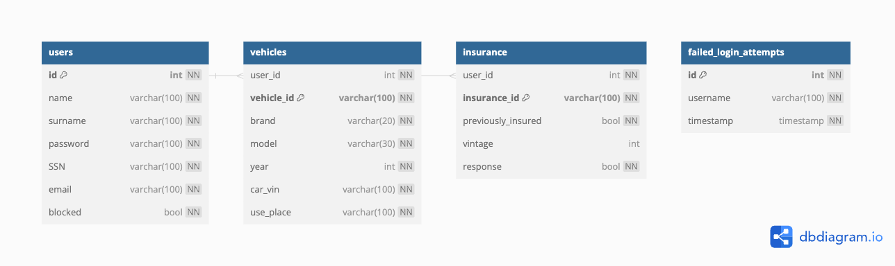

# Proyecto Ética y Seguridad de los Datos: Vehicle Guard

## Contexto e Introducción al Proyecto

El proyecto se centra en el análisis del dataset [Health Insurance Cross Sell Prediction](https://www.kaggle.com/datasets/anmolkumar/health-insurance-cross-sell-prediction) que contiene 381,000 filas, con el objetivo de mejorar la rentabilidad de pólizas/promociones y predecir la retención de clientes.

## Sobre la base de datos y las transformaciones necesarias

El dataset original contiene las siguientes variables:

| Variable              | Descripción                                                   |
|----------------------|---------------------------------------------------------------|
| Gender               | Género del cliente                                            |
| Age                  | Edad del cliente                                              |
| Previously_Insured   | 1 : Cliente tiene seguro de vehículo, 0 : Cliente no tiene seguro de vehículo |
| Vehicle_Age          | Tiempo del vehículo                                           |
| Vehicle_Damage       | 1 : Cliente dañó su vehículo en el pasado. 0 : Cliente no dañó su vehículo en el pasado |
| Annual_Premium       | Monto que necesita pagar el cliente como premium en el año   |
| Policy_Sales_Channel | Código anónimo del canal de comunicación con el cliente (Correo, persona, teléfono, etc) |
| Vintage              | Número de días que el cliente ha estado asociado con la compañía |
| Response             | 1 : Cliente interesado, 0 : Cliente no interesado              |


Sobre la data real, se agregará data mock que puede ser considerada sensible sobre cada cliente incluyendo:

| Variable      | Descripción                                      |
|---------------|--------------------------------------------------|
| id            | Identificador único para el usuario              |
| name          | Nombre de la persona                             |
| surname       | Apellido de la persona                           |
| password      | Contraseña del usuario                           |
| SSN           | Número de tarjeta de crédito                     |
| email         | Correo electrónico de la persona                 |
| blocked       | Indicador de si el usuario está bloqueado        |
| user_id       | Identificador del usuario (referencia a `users`) |
| vehicle_id    | Identificador único para el vehículo             |
| brand         | Marca del vehículo                               |
| model         | Modelo del vehículo                              |
| year          | Año del vehículo                                 |
| car_vin       | Número de identificación del vehículo (VIN)      |
| use_place     | Lugar de uso del vehículo                        |
| insurance_id  | Identificador único para el seguro               |
| username      | Nombre de usuario para intentos de login        |
| timestamp     | Marca de tiempo del intento de login fallido    |


La estructura de la base de datos se detalla en las siguientes tablas:

```sql
CREATE TABLE users(
    id int NOT NULL AUTO_INCREMENT,
    name varchar(100) NOT NULL,
    surname varchar(100) NOT NULL,
    password varchar(100) NOT NULL,
    SSN varchar(100) UNIQUE NOT NULL,
    email varchar(100) UNIQUE NOT NULL,
    blocked bool NOT NULL,
    PRIMARY KEY(id)
);

CREATE TABLE vehicles(
    user_id int UNIQUE NOT NULL,
    vehicle_id varchar(100) UNIQUE NOT NULL,
    brand varchar(20) NOT NULL,
    model varchar(30) NOT NULL,
    year int NOT NULL,
    car_vin varchar(100) UNIQUE NOT NULL,
    use_place varchar(100) NOT NULL,
    FOREIGN KEY (user_id) REFERENCES users(id),
    PRIMARY KEY(vehicle_id)
);

CREATE TABLE insurance(
    user_id int UNIQUE NOT NULL,
    insurance_id varchar(100) UNIQUE NOT NULL,
    previously_insured bool NOT NULL,
    vintage int,
    response bool NOT NULL, 
    FOREIGN KEY (user_id) REFERENCES users(id),
    PRIMARY KEY(insurance_id)
);

CREATE TABLE failed_login_attempts(
    id int NOT NULL AUTO_INCREMENT,
    username varchar(100) NOT NULL,
    timestamp timestamp NOT NULL,
    PRIMARY KEY(id)
);


```

### Diagrama E-R




## Requerimientos de Negocio

Los KPIs definidos son:


**1. Tasa de conversión a Seguros de Autos:** 
   - Fórmula: $\dfrac{\text{Número de clientes interesados}}{\text{Número de clientes contactados}} \times 100$

**2. Tasa de renovación de Seguros de Autos:** 
   - Fórmula: $\dfrac{\text{Número de clientes que contaban previamente con seguro de auto}}{\text{Total de clientes del año pasado}} \times 100$

**3. Prima anual promedio:** 
   - Fórmula: $\dfrac{\text{Suma anual de primas totales}}{\text{Total de clientes}}$

**4. Antigüedad promedio de los clientes:** 
   - Fórmula: $\dfrac{\text{Suma total de días de antigüedad de clientes}}{\text{Total de clientes}}$

**5. Tasa de cotizaciones completadas:** 
   - Fórmula: $\dfrac{\text{Número de cotizaciones completadas}}{\text{Número de cotizaciones iniciadas}} \times 100$


Los OKRs son:


**Objetivo: Aumentar la captación de leads a través del formulario de cotización**

- **Resultado Clave 1:** Incrementar el número de cotizaciones completadas en el formulario en un 20% para el final del Q2.
- **Resultado Clave 2:** Mejorar la tasa de retención de clientes que regresan para realizar una nueva cotización en un 15% para el final del Q3.

**Objetivo: Mejorar la eficiencia y usabilidad del formulario de cotización**

- **Resultado Clave 1:** Reducir el tiempo promedio de completado del formulario en un 25% a través de optimizaciones de UX/UI para el final del Q1.
- **Resultado Clave 2:** Obtener una puntuación de satisfacción del cliente de 90% o más respecto a la facilidad de uso del formulario para el final del Q2.


## Requerimientos de Seguridad

### En Reposo:

- Cifrado de datos en AWS.
- AWS Key Management Service (Keyvault).
- Configuración adecuada de los IAM.
- Almacenamiento apropiado de logs (alternativa a CloudWatch si no es suficiente).
- Hashing de usuarios.

### En Transporte:

- HTTPS (si es posible en el tiempo dado).
- Verificación de emisor y receptor.
- Grupos de seguridad en AWS como firewall.
- CORS

### Gestión de Accesos:

- RBAC.
- MFA
- OTP.

### Logs y Auditoría:

- Herramienta para revisión de logs.
- Sistema de alertas.


## Estrategias de uso seguro de los datos

Se detallan las políticas, procedimientos y estándares, y la concienciación y formación del equipo respecto a la seguridad de los datos.

### Políticas
Desarrolla políticas claras y sólidas que establezcan las reglas y normativas para el acceso, uso y manejo de los datos.

- Requiere autenticación de dos factores (2FA) para el acceso a sistemas y aplicaciones que almacenan datos sensibles.
- Requiere contraseñas fuertes y periódicamente cambiantes.
- Exige el cifrado de datos sensibles tanto en reposo como en tránsito.
- Define algoritmos y estándares de cifrado a utilizar.
- Exige acuerdos de confidencialidad y seguridad con terceros que manejen datos sensibles.

### Procedimientos y estándares

Crea procedimientos detallados para la recopilación, almacenamiento, transmisión y eliminación segura de datos e implementa estándares de seguridad de datos reconocidos, como ISO 27001, para garantizar buenas prácticas.

- Creación y gestión de credenciales de usuario, junto con su autenticación en sistemas y aplicaciones.
- Creación, cambio y gestión de contraseñas de usuario teniendo en cuenta la prohibición de compartir contraseñas.
- Configuración y mantenimiento de la infraestructura de cifrado.
- Realización de copias de seguridad regulares y restauración de datos en caso de pérdida o corrupción.
- Reglamento General de Protección de Datos (GDPR) de la Unión Europea: El GDPR es una regulación de la UE que establece estándares para la protección de datos personales.
- AES (Advanced Encryption Standard): AES es uno de los estándares de encriptación más ampliamente utilizados en todo el mundo. Estamos implementado AES-256 para encriptar la data.
- RSA (Rivest-Shamir-Adleman): RSA es un estándar de encriptación asimétrica que se utiliza para la encriptación de datos y la autenticación. Mientras que usamos RSA-256 para encriptar y desencriptar la llave del AES.

### Concientización y formación del equipo

Proporciona capacitación y concienciación sobre seguridad de datos a todos los miembros del equipo, desde empleados hasta directivos y se fomenta una cultura de seguridad de datos en la que todos comprendan la importancia de proteger la información.

- Se cubren temas como la gestión de contraseñas, la identificación de correos electrónicos de phishing y las mejores prácticas de seguridad en general.
- Realiza simulaciones de ataques de phishing para ayudar a los empleados a reconocer correos electrónicos maliciosos y a tomar decisiones seguras, con ello, se proporciona retroalimentación y refuerza las prácticas correctas.
- Utiliza juegos y ejercicios interactivos para enseñar conceptos de seguridad de datos de manera divertida y memorable.
- Comparte historias de casos y ejemplos reales de incidentes de seguridad de datos, tanto internos como externos, para ilustrar las amenazas y sus impactos.
- Proporciona a los empleados materiales educativos, como folletos, infografías y videos, que resuman las mejores prácticas de seguridad.
- Realiza pruebas periódicas de conocimientos para medir la comprensión de los empleados sobre seguridad de datos. Luego, se proporciona retroalimentación y refuerza las áreas que necesitan mejora.
- Asegurarse de que los empleados estén al tanto de las políticas de uso aceptable de la tecnología y de las consecuencias de su incumplimiento.
- Proporciona formación especializada a los equipos de TI y seguridad de datos para mantenerlos al tanto de las últimas amenazas y técnicas de mitigación.

## Plan de respuesta ante incidentes de seguridad

En caso de una fuga o pérdida de datos, se plantea el siguiente plan básico de acción:

1. **Confirmar la fuga o pérdida de los datos y evaluar la magnitud del evento:**
    - De esta manera, determinamos cuáles y cuántos datos han sido afectados, si se trata de datos privados de los usuarios o datos internos de la aseguradora, y cuándo ocurrió la fuga para entender la gravedad del incidente.
2. **Aislamiento y Mitigación del daño sobre las áreas afectadas:**
    - Al aislar las áreas afectadas evitamos que el daño pueda convertirse en colateral y afectar otras áreas o procesos del servicio web. A su vez, se toma medidas para mitigar cualquier daño adicional o propagación de la fuga, mediante desconexiones de sistemas, cambios de contraseñas y cambios en las restricciones de acceso.
3. **Notificación a las partes afectadas:**
    - Comunicar a las partes interesadas de la aseguradora y, de ser necesario, también a los clientes afectados de manera transparente y oportuna, informando que el servicio web podría encontrarse caído por un tiempo hasta que se contenga y arregle el daño.
4. **Realizar una investigación interna sobre los Logs del sistema:**
    - De esta manera, mediante análisis forense, se puede identificar las causas de la fuga, quiénes estuvieron involucrados, la debilidad en la zona vulnerada y, más adelante, se puede plantear cómo se pudo haber prevenido.
5. **Reparación y Mejoras:**
    - Realizar las correcciones necesarias para evitar futuras fugas de datos, ya sea que haya ocurrido de manera intencional o no intencional, y se pueda mejorar la seguridad del sistema.
6. **Monitoreo Continuo:**
    - Si bien se espera que esa área esté arreglada y protegida de cualquier daño, es importante que después de un evento similar se mantenga un monitoreo más intencional sobre el área afectada, así se pueda detectar de manera más proactiva cualquier actividad que se considere fuera de lo común.

## Recomendaciones de Protección de Datos Futura

A futuro, nos gustaría terminar de implementar mejores reglas de acceso basadas en roles para garantizar que solo las personas autorizadas tengan acceso a los datos específicos que requieran. Dado que, hasta el momento, solo tenemos dos roles muy básicos para un administrador y un analista de datos de los vehículos y su interés por el seguro vehicular.

A pesar de nuestra intención de reforzar la seguridad con VPN y WAF, no logramos implementar estas medidas debido a limitaciones de recursos (p.ej. en AWS con el WAF) y complejidades técnicas en el caso del VPN. Si bien estas carencias nos podrían dejar expuestos como servicio, quisieramos tratar de implementar el WAF e investigar una especie de simulación del VPN. 

Por último, también buscaríamos una mejor gestión e implementación de políticas de contraseñas periódicamente cambiantes, y de gestión de certificados para nuestro gestor de Base de Datos (MySQL). Como también pruebas de penetración periódicas para evaluar nuestra seguridad.

&copy; 2023 Proyecto DS3031
