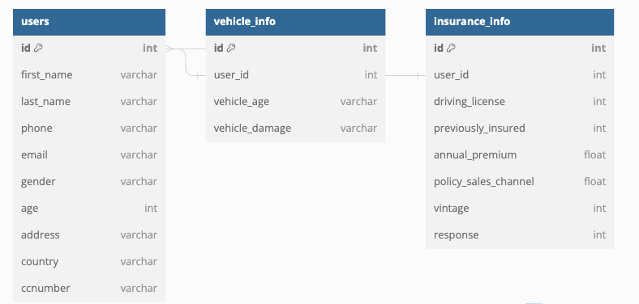

# Proyecto Ética y Seguridad de los Datos: Health Insurance Cross Sell Prediction

## Contexto e Introducción al Proyecto

El proyecto se centra en el análisis del dataset [Health Insurance Cross Sell Prediction](https://www.kaggle.com/datasets/anmolkumar/health-insurance-cross-sell-prediction) que contiene 381,000 filas, con el objetivo de optimizar la estrategia de canales de ventas, segmentar eficientemente a los clientes, mejorar la rentabilidad de pólizas/promociones y predecir la retención de clientes.

## Sobre la base de datos y las transformaciones necesarias

El dataset original contiene las siguientes variables:

- Gender, Age, Driving_License, Previously_Insured, Vehicle_Age, Vehicle_Damage, Annual_Premium, Policy_Sales_Channel, Vintage, y Response.

Se agregará data mock de cada cliente incluyendo: Full name (o iniciales para anonimización), Date of birth (o age), Address, Phone numbers, Email address, y Social security number (o national identification number).

La estructura de la base de datos se detalla en las siguientes tablas:

```sql
CREATE TABLE `users` (
  `id` int PRIMARY KEY,
  `first_name` varchar(255),
  `last_name` varchar(255),
  `phone` varchar(255),
  `email` varchar(255),
  `gender` varchar(255),
  `age` int,
  `address` varchar(255),
  `country` varchar(255),
  `ccnumber` varchar(255)
);

CREATE TABLE `vehicle_info` (
  `id` int PRIMARY KEY,
  `vehicle_in` int,
  `user_id` int,
  `vehicle_age` varchar(255),
  `vehicle_damage` varchar(255)
);

CREATE TABLE `insurance_info` (
  `id` int PRIMARY KEY,
  `user_id` int,
  `driving_license` int,
  `previously_insured` int,
  `annual_premium` float,
  `policy_sales_channel` float,
  `vintage` int,
  `response` int
);

ALTER TABLE `users` ADD FOREIGN KEY (`id`) REFERENCES `insurance_info` (`user_id`);

ALTER TABLE `users` ADD FOREIGN KEY (`id`) REFERENCES `vehicle_info` (`user_id`);
```

### Diagrama E-R




## Requerimientos de Negocio

Los KPIs definidos son:

- Optimización en la Estrategia de Canales de Ventas.
- Segmentación eficiente de clientes.
- Mejorar la rentabilidad de “Pólizas/Promociones”.
- Predicción de Retención de Clientes.

## Requerimientos de Seguridad

### En Reposo:

- Cifrado de datos en AWS.
- AWS Key Management Service (Keyvault).
- Configuración adecuada de los IAM.
- Almacenamiento apropiado de logs (alternativa a CloudWatch si no es suficiente).
- Hashing de usuarios.

### En Transporte:

- HTTPS (si es posible en el tiempo dado).
- Verificación de emisor y receptor.
- Grupos de seguridad en AWS como firewall.

### Gestión de Accesos:

- RBAC, ABAC.
- MFA.
- OTP.

### Logs y Auditoría:

- Herramienta para revisión de logs.
- Sistema de alertas.

## Recomendaciones de Protección de Datos Futura

- VPN, WAF, Tokenización de datos sensibles.
- (Pseudo) Anonimización de datos, IDS/IPS, Pruebas de penetración periódicas.
- Gestión mejorada de claves y certificados.

## Estrategias de uso seguro de los datos

Se detallan las políticas, procedimientos y estándares, y la concienciación y formación del equipo respecto a la seguridad de los datos.

## Lecciones Aprendidas y Retrospectiva

(Reflexiones sobre lo aprendido y cómo mejorar en futuros proyectos)

---

&copy; 2023 Proyecto DS3031
